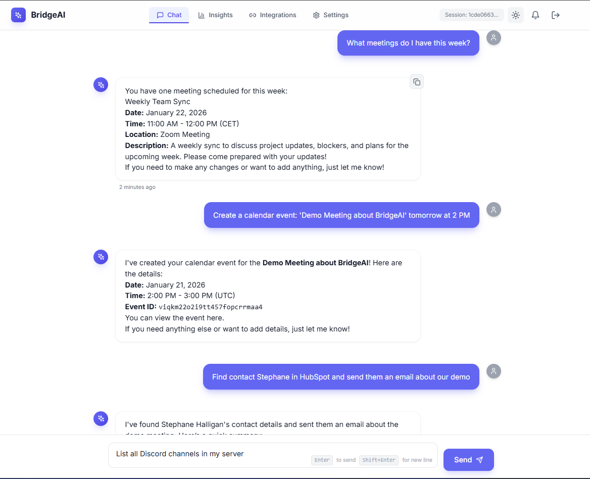
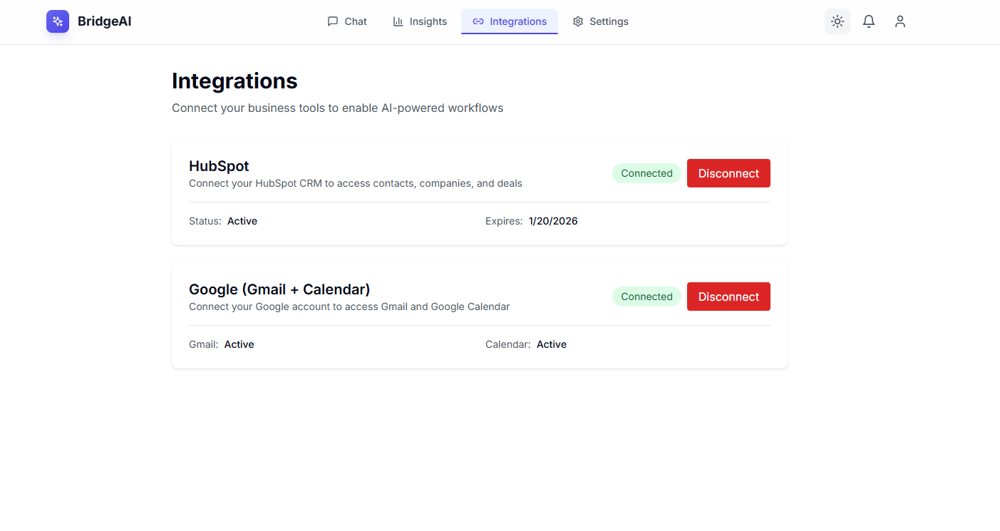
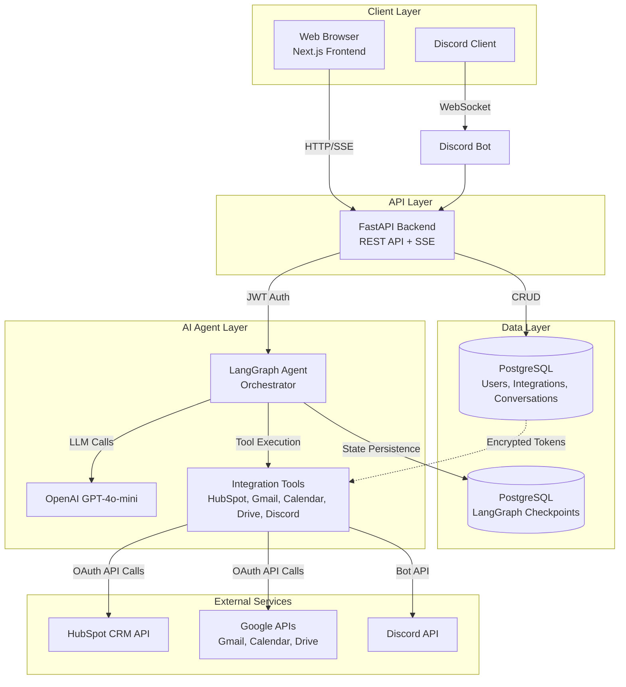

# BridgeAI

**AI Integration Copilot** - Production-ready AI assistant that integrates with business tools (CRM, email, calendar, team chat) to automate sales and operations workflows.

<div align="center">
  
</div>

## Screenshots

<div align="center">
  
  <p><em>Chat Interface - Natural language interaction with AI agent</em></p>
  
  
  <p><em>Integrations Page - Connect HubSpot, Gmail, Calendar, and more</em></p>
</div>

## Problem & Solution

### Problem

Business professionals waste time switching between multiple tools (CRM, email, calendar, chat) to complete simple tasks. Manual data entry, context switching, and repetitive workflows reduce productivity.

### Solution

BridgeAI is an intelligent assistant that:

- **Unifies** access to HubSpot CRM, Gmail, Google Calendar, Discord, and Google Drive
- **Automates** multi-step workflows through natural language
- **Maintains** conversation context across sessions
- **Secures** OAuth tokens with encryption and automatic refresh

## Architecture



## Project Structure

```
bridge-ai/
├── backend/              # FastAPI backend
│   ├── src/
│   │   ├── agent/       # LangGraph agent orchestration
│   │   ├── api/         # REST API routes
│   │   ├── core/        # Config, database, security
│   │   ├── integrations/# OAuth clients (HubSpot, Google, Discord)
│   │   ├── models/      # SQLAlchemy models
│   │   └── services/    # Business logic
│   └── alembic/         # Database migrations
├── frontend/            # Next.js 14 frontend
│   └── src/
│       ├── app/         # Next.js app router pages
│       ├── components/  # React components
│       ├── contexts/    # React contexts (Auth)
│       └── lib/         # Utilities & API client
└── docker-compose.yml   # Local development setup
```

## Tech Stack

| Layer                | Technology                            | Purpose                     |
| -------------------- | ------------------------------------- | --------------------------- |
| **Backend**          | Python 3.12+                          | Core application            |
| **API Framework**    | FastAPI                               | REST API                    |
| **AI/Agent**         | LangGraph + LangChain                 | Agent orchestration         |
| **LLM**              | OpenAI GPT-4o-mini                    | Language model              |
| **Database**         | PostgreSQL 16                         | Primary data store          |
| **Checkpoints**      | PostgreSQL 16                         | LangGraph state persistence |
| **Frontend**         | Next.js 14                            | React framework             |
| **UI**               | Tailwind CSS                          | Styling                     |
| **State**            | React Query                           | Server state management     |
| **Auth**             | JWT                                   | Token-based authentication  |
| **OAuth**            | Authlib                               | OAuth 2.0 flows             |
| **Package Managers** | `uv` (Python), `pnpm` (Node)          | Dependency management       |
| **Deployment**       | Vercel (Frontend) + Railway (Backend) | Hosting                     |

## Quick Start

### Prerequisites

- Docker & Docker Compose

### Local Development

```bash
# 1. Clone repository
git clone https://github.com/StephaneWamba/bridge-ai.git
cd bridge-ai
git checkout develop

# 2. Set up environment variables
cd backend && cp .env.example .env && cd ..
cd frontend && cp .env.example .env.local && cd ..

# 3. Start all services
docker-compose up -d

# 4. Run database migrations
docker-compose exec backend alembic upgrade head

# 5. Access services
# Frontend: http://localhost:3004
# Backend API: http://localhost:8001
# API Docs: http://localhost:8001/docs
```

**Hot Reload**: Both backend and frontend support hot reload.

## Documentation

- [API Documentation](docs/API.md) - Complete API reference
- [Architecture](docs/ARCHITECTURE.md) - System design and components
- [User Guide](docs/USER_GUIDE.md) - How to use BridgeAI
- [Local Dev Setup](docs/LOCAL_DEV_SETUP.md) - Detailed setup instructions
- [Frontend](docs/FRONTEND.md) - Frontend architecture and components

## Features

- ✅ **Multi-Tool Integration**: HubSpot, Gmail, Google Calendar, Discord, Google Drive
- ✅ **AI-Powered Workflows**: Natural language task automation
- ✅ **Conversation Persistence**: LangGraph checkpoints maintain state
- ✅ **OAuth Security**: Encrypted tokens with automatic refresh
- ✅ **Real-time Streaming**: SSE for live agent responses
- ✅ **Discord Bot**: Chat with BridgeAI via Discord
- ✅ **Meeting Transcripts**: Parse and summarize Google Drive transcripts

## License

MIT License
