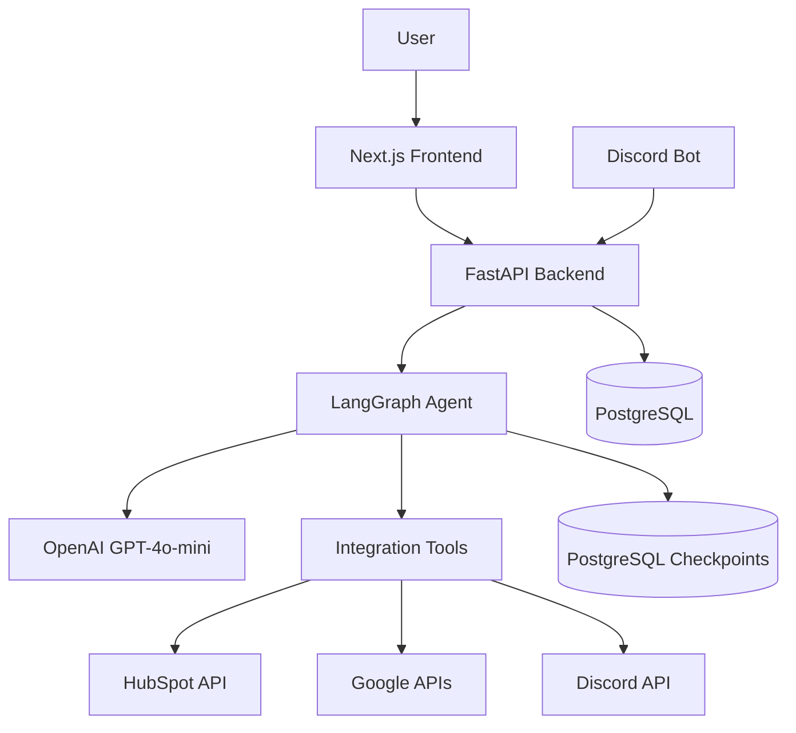
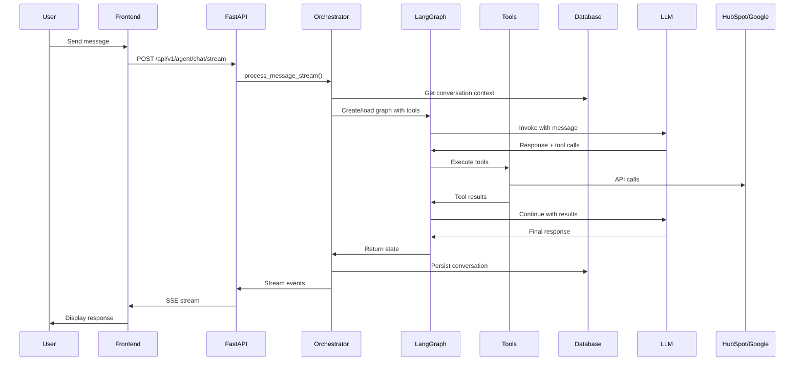
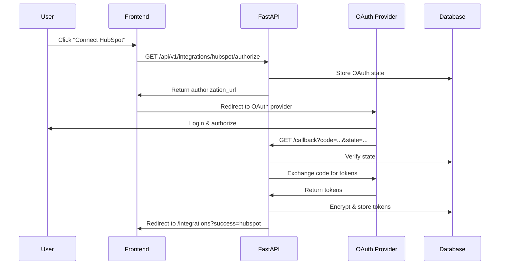
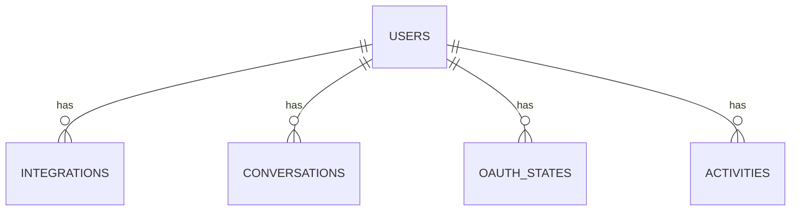
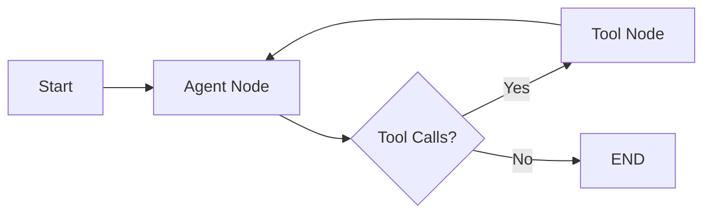

# Architecture Documentation

System design and component architecture for BridgeAI.

## System Overview



## Component Architecture

### Backend Layers

| Layer            | Components          | Responsibility                     |
| ---------------- | ------------------- | ---------------------------------- |
| **API**          | `src/api/routes/`   | HTTP endpoints, request validation |
| **Services**     | `src/services/`     | Business logic, orchestration      |
| **Agent**        | `src/agent/`        | LangGraph agent, tool execution    |
| **Integrations** | `src/integrations/` | OAuth clients, API wrappers        |
| **Models**       | `src/models/`       | SQLAlchemy ORM models              |
| **Core**         | `src/core/`         | Config, database, security, cache  |

### Frontend Layers

| Layer          | Components        | Responsibility           |
| -------------- | ----------------- | ------------------------ |
| **Pages**      | `src/app/`        | Next.js app router pages |
| **Components** | `src/components/` | React UI components      |
| **Contexts**   | `src/contexts/`   | React state management   |
| **Lib**        | `src/lib/`        | API client, utilities    |

## Data Flow

### Chat Request Flow



### OAuth Flow



## Database Schema

### Core Tables

| Table           | Purpose         | Key Fields                                        |
| --------------- | --------------- | ------------------------------------------------- |
| `users`         | User accounts   | `id`, `email`, `hashed_password`                  |
| `integrations`  | OAuth tokens    | `user_id`, `provider`, `access_token` (encrypted) |
| `conversations` | Chat history    | `user_id`, `session_id`, `messages` (JSON)        |
| `oauth_states`  | CSRF protection | `state`, `provider`, `user_id`, `expires_at`      |
| `activities`    | Audit log       | `user_id`, `action`, `status`, `extra_data`       |

### Relationships



## Agent Architecture

### LangGraph State

```python
class AgentState(TypedDict):
    messages: Sequence[AnyMessage]  # Conversation history
    user_id: str                     # User identifier
    session_id: str                  # Thread identifier
    tool_calls: list[dict]           # Tool execution log
    context: dict                     # Workflow context
```

### Graph Structure



**Nodes:**

- **Agent Node**: LLM processes messages, decides on tool usage
- **Tool Node**: Executes tools (HubSpot, Gmail, Calendar, etc.)

### Tool Categories

| Category     | Tools                                                          | Purpose             |
| ------------ | -------------------------------------------------------------- | ------------------- |
| **HubSpot**  | `search_contacts`, `update_contact`, `create_note`             | CRM operations      |
| **Gmail**    | `read_emails`, `send_email`, `reply_email`                     | Email management    |
| **Calendar** | `list_events`, `create_event`, `update_event`                  | Calendar operations |
| **Drive**    | `list_files`, `read_file`, `create_file`                       | Document management |
| **Discord**  | `send_message`, `read_messages`, `list_channels`               | Team communication  |
| **Meeting**  | `read_transcript`, `summarize_meeting`, `extract_action_items` | Meeting analysis    |

## Security

### Token Encryption

- **Algorithm**: Fernet (symmetric encryption)
- **Key Derivation**: PBKDF2-HMAC-SHA256
- **Storage**: Encrypted tokens in database
- **Refresh**: Automatic token refresh before expiry

### Authentication Flow

1. User signs up/logs in → JWT tokens generated
2. Access token (30 min) used for API requests
3. Refresh token (7 days) used to get new access token
4. Tokens stored in localStorage (frontend)

### OAuth Security

- **State Parameter**: CSRF protection for OAuth flows
- **Token Storage**: Encrypted in database
- **Scope Management**: Minimal required scopes per integration

## Caching Strategy

| Cache Key                          | TTL   | Purpose                     |
| ---------------------------------- | ----- | --------------------------- |
| `integration:{user_id}:{provider}` | 5 min | Integration lookups         |
| (Future)                           |       | Tool results, API responses |

## Performance Optimizations

1. **Connection Pooling**: SQLAlchemy async pool (10 connections, 20 overflow)
2. **Caching**: In-memory cache for frequent queries
3. **Async Operations**: All I/O operations are async
4. **Database Indexes**: Composite indexes on `(user_id, provider)`, `(user_id, session_id)`

## Scalability Considerations

### Current Limitations

- Single PostgreSQL instance
- In-memory cache (not shared across instances)
- No horizontal scaling for agent execution

### Future Improvements

- Redis for distributed caching
- Message queue for async agent processing
- Load balancer for multiple backend instances
- Database read replicas

## Error Handling

### Error Types

| Error                     | Handling Strategy                           |
| ------------------------- | ------------------------------------------- |
| **Authentication**        | Return 401, clear tokens, redirect to login |
| **Token Expiry**          | Auto-refresh via refresh token              |
| **API Rate Limits**       | Return user-friendly message, don't retry   |
| **Tool Failures**         | Log error, return formatted error to user   |
| **Checkpoint Corruption** | Create new session_id, retry                |

### Error Recovery

- **Checkpoint Corruption**: Automatic session recreation
- **OAuth Failures**: Clear state, allow retry
- **Database Errors**: Rollback transaction, return error

## Monitoring & Observability

### Logging

- **Levels**: INFO, WARNING, ERROR
- **Structured**: JSON format for production
- **Context**: User ID, session ID, tool names

### Metrics (Future)

- Request latency
- Tool execution time
- Error rates
- Token refresh frequency
