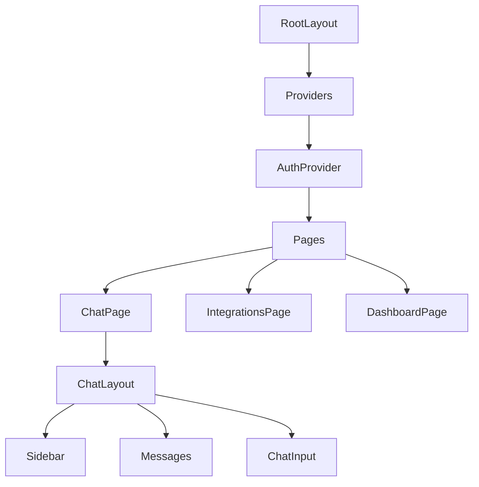

# Frontend Documentation

Architecture and implementation details for the BridgeAI frontend.

## Tech Stack

| Technology | Version | Purpose |
|-----------|---------|---------|
| **Next.js** | 14.1.0 | React framework with App Router |
| **React** | 18.2.0 | UI library |
| **TypeScript** | 5.3.3 | Type safety |
| **Tailwind CSS** | 3.4.1 | Styling |
| **React Query** | 5.17.0 | Server state management |
| **Framer Motion** | 10.16.16 | Animations |
| **Next Themes** | 0.2.1 | Dark mode |

## Project Structure

```
frontend/
├── src/
│   ├── app/                    # Next.js App Router
│   │   ├── auth/              # Authentication pages
│   │   ├── chat/              # Chat interface
│   │   ├── dashboard/         # Dashboard pages
│   │   ├── integrations/      # Integration management
│   │   └── layout.tsx         # Root layout
│   ├── components/            # React components
│   │   ├── auth/              # Auth components
│   │   ├── chat/              # Chat components
│   │   ├── dashboard/         # Dashboard components
│   │   ├── landing/           # Landing page components
│   │   └── ui/                # Reusable UI components
│   ├── contexts/              # React contexts
│   │   └── AuthContext.tsx    # Authentication state
│   └── lib/                   # Utilities
│       ├── api/               # API client
│       └── utils/             # Helper functions
└── public/                     # Static assets
```

## Architecture

### Component Hierarchy



### State Management

| State Type | Solution | Location |
|-----------|----------|----------|
| **Auth State** | React Context | `src/contexts/AuthContext.tsx` |
| **Server State** | React Query | `src/lib/api/queries.ts` |
| **UI State** | React useState | Component-level |
| **Theme** | Next Themes | `src/app/providers.tsx` |

## Key Components

### Authentication

#### `AuthContext`
- Manages user authentication state
- Provides `login`, `signup`, `logout`, `refreshToken`
- Stores tokens in localStorage
- Auto-loads user on mount

**Usage:**
```typescript
const { user, login, logout } = useAuth();
```

#### `ProtectedRoute`
- Wraps protected pages
- Redirects to login if not authenticated
- Shows loading state during auth check

### Chat Interface

#### `ChatPage`
- Main chat interface
- Manages messages state
- Handles SSE streaming
- Loads conversation history

**Features:**
- Real-time message streaming
- Conversation sidebar
- Message history persistence
- Error handling

#### `ChatLayout`
- Layout wrapper for chat
- Includes sidebar and message area
- Responsive design

#### `MessageBubble`
- Displays individual messages
- Supports user and assistant messages
- Shows tool calls
- Markdown rendering

#### `ChatInput`
- Message input component
- Handles Enter key (send) and Shift+Enter (newline)
- Loading state during requests
- Auto-focus

#### `Sidebar`
- Conversation list
- New conversation button
- Active session highlighting
- Conversation preview

### Integrations

#### `IntegrationsPage`
- Lists available integrations
- Shows connection status
- Handles OAuth flows
- Displays success/error messages

**Features:**
- Real-time status updates
- OAuth redirect handling
- Disconnect functionality
- Status indicators

### Dashboard

#### `DashboardLayout`
- Wrapper for dashboard pages
- Navigation sidebar
- Header with user info
- Theme toggle

#### `DashboardSidebar`
- Navigation menu
- Active route highlighting
- Responsive collapse

## API Integration

### API Client

**Location**: `src/lib/api/client.ts`

**Features:**
- Automatic token injection
- Token refresh on 401
- Error handling
- TypeScript types

**Usage:**
```typescript
import { fetchAPI } from '@/lib/api/client';

const data = await fetchAPI<ResponseType>('/api/v1/endpoint');
```

### React Query

**Location**: `src/lib/api/queries.ts` (to be implemented)

**Planned Features:**
- Cached API responses
- Automatic refetching
- Optimistic updates
- Error retry logic

## Styling

### Tailwind CSS

- Utility-first CSS framework
- Dark mode support via `dark:` prefix
- Responsive design with breakpoints
- Custom theme configuration

### Theme Configuration

**Location**: `tailwind.config.ts`

**Features:**
- Custom color palette
- Dark mode support
- Animation utilities
- Custom spacing

### Dark Mode

- Implemented via Next Themes
- System preference detection
- Manual toggle available
- Persists across sessions

## Routing

### App Router Structure

| Route | Page | Auth Required |
|-------|------|---------------|
| `/` | Landing page | No |
| `/auth/login` | Login page | No |
| `/auth/signup` | Signup page | No |
| `/chat` | Chat interface | Yes |
| `/integrations` | Integration management | Yes |
| `/dashboard` | Dashboard | Yes |
| `/dashboard/settings` | User settings | Yes |
| `/dashboard/insights` | Analytics | Yes |

### Route Protection

- `ProtectedRoute` component wraps protected pages
- Checks authentication status
- Redirects to login if not authenticated

## Real-time Features

### Server-Sent Events (SSE)

**Implementation**: `ChatPage` component

**Flow:**
1. User sends message
2. POST request to `/api/v1/agent/chat/stream`
3. Server streams events via SSE
4. Client parses `data: {...}` events
5. Updates UI with response chunks

**Event Types:**
- `response` - Final agent response
- `error` - Error occurred

## Performance Optimizations

### Code Splitting

- Next.js automatic code splitting
- Dynamic imports for heavy components
- Route-based splitting

### Image Optimization

- Next.js Image component
- Automatic format optimization
- Lazy loading

### Caching

- React Query caching (planned)
- Static asset caching
- API response caching

## Accessibility

### ARIA Labels

- Semantic HTML elements
- Proper heading hierarchy
- Form labels and inputs

### Keyboard Navigation

- Tab navigation
- Enter to submit
- Escape to cancel (planned)

## Error Handling

### API Errors

- Automatic token refresh on 401
- User-friendly error messages
- Error boundaries (planned)

### Network Errors

- Retry logic (planned)
- Offline detection (planned)
- Error state UI

## Development

### Running Locally

```bash
# Install dependencies
pnpm install

# Run development server
pnpm dev

# Type check
pnpm type-check

# Lint
pnpm lint

# Format
pnpm format
```

### Building for Production

```bash
# Build
pnpm build

# Start production server
pnpm start
```

## Testing (Planned)

- Unit tests with Jest
- Component tests with React Testing Library
- E2E tests with Playwright
- Visual regression tests

## Future Improvements

1. **Offline Support**: Service worker for offline functionality
2. **PWA**: Progressive Web App capabilities
3. **Real-time Updates**: WebSocket for live updates
4. **Advanced Caching**: React Query integration
5. **Error Boundaries**: Better error recovery
6. **Performance Monitoring**: Web Vitals tracking

